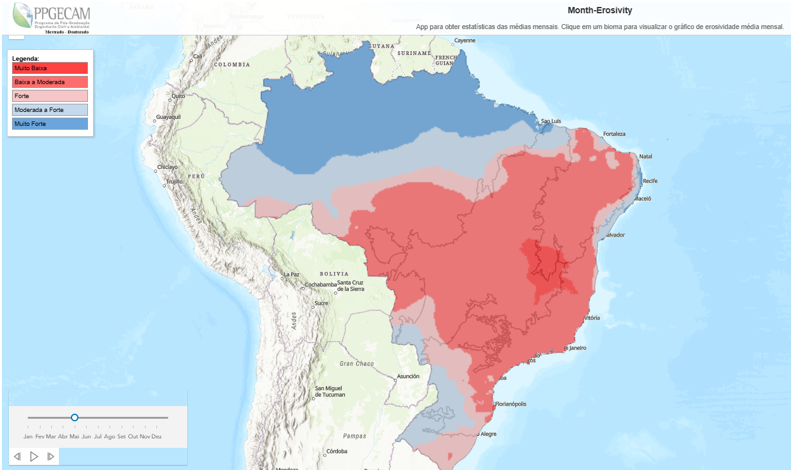

# Erosivity Analysis and Mapping

This repository contains code and data used to calculate and visualize rainfall erosivity (EI30 index) across Brazilian regions using 10 min rainfall data from CEMADEN and ANA (2014–2024).

## 📂 Contents

- `*.ipynb`: Jupyter notebooks for:
  - Data quality control
  - EI30 calculation
  - Monthly and annual aggregation
  - Spatial interpolation and mapping

- `*.h5`: HDF5 files containing processed datasets and results.

## 📊 Interactive Map (EI30 Viewer)

An interactive map is available to visualize monthly erosivity statistics by biome using ArcGIS JS API and Chart.js.

🧭 **Access the map here**: [https://erosivity-hub.netlify.app/app/](https://erosivity-hub.netlify.app/app/)  

## 🧪 Data Sources

- CEMADEN (Brazilian National Center for Monitoring and Early Warning of Natural Disasters)
- ANA (Brazilian National Water Agency)

## 📎 Methodology Overview

1. Raw rainfall data cleaning and validation
2. EI30 computation using intensity-duration data
3. Generation of monthly and yearly summaries
4. Spatial interpolation (Kriging)
5. Visualization through interactive web maps

# Erosivity Analysis and Mapping

...

## 🖼️ Preview

